# 🏡 우리집 : 아파트 실거래가 검색 사이트

## ⏳ 프로젝트 진행 기간
2022.11.15 ~ 2022.11.25 (11일간 진행)

## 📢 서비스 개요
공공데이터포털 국토교통부 아파트 매매 실거래 자료를 바탕으로 하여 아파트 매매 상세 정보 및 검색 시 편리한 기능을 제공

## 🤝 팀원 및 역할
| 지강훈 | 소지현 |
| ------ | ---------------------------------------------------------- |
| DB 설계 | 프론트 컴포넌트 구조 |
| 데이터 저장 | 스프링 구조 설계 |
| 백엔드 설계 | 카카오 API |
| 뷰~스프링 CRUD | 디자인 |

## ✨ 기술 스택
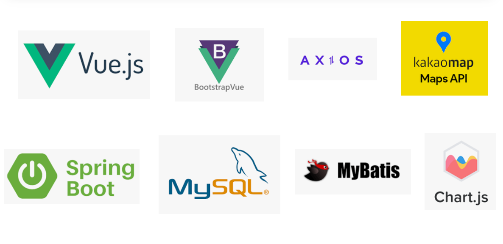

## 🔎 서비스 화면
### 메인페이지

### 회원시스템
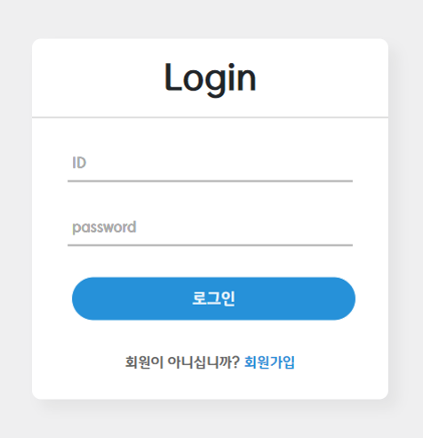  
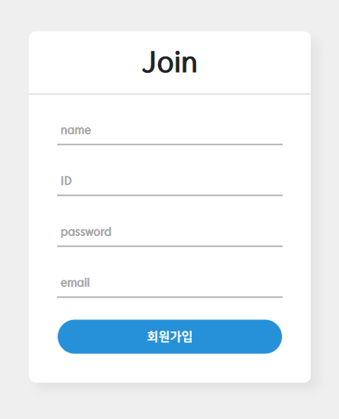  
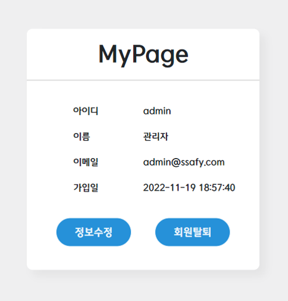  
- 회원가입: 비동기 ID 유효성 및 중복 체크 기능 추가 
- 로그인: ACCESS, REFRESH Token 사용, 주요 서비스 접근 시 토큰 만료 체크

### 공지사항
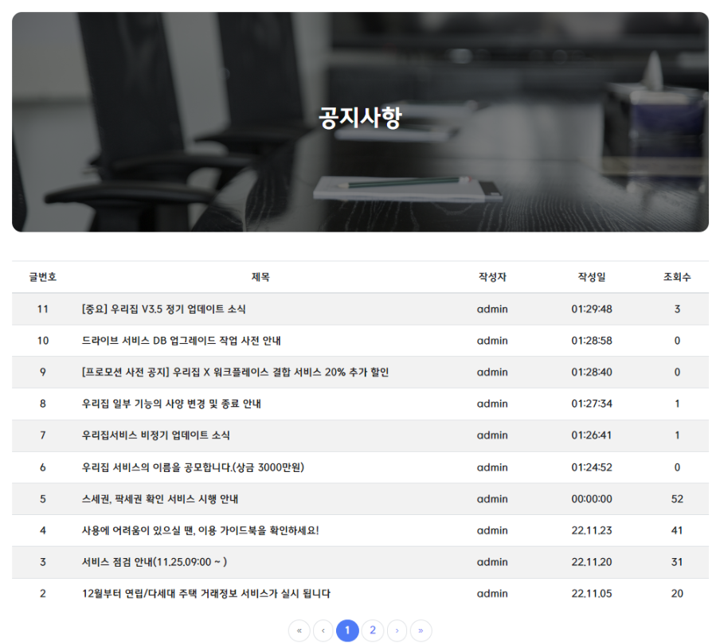  
  
- b-table, b-pagination
- 관리자 아닐 시 글쓰기 버튼 활성화 X (회원 DB에 관리자 role 1로 부여)
- 작성자 id - 공지사항 id 제약 조건

### 아파트정보 - 지도 화면
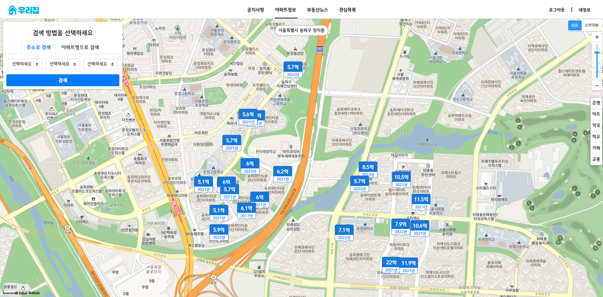  
편의시설 마커 및 축척 조절, 지도/스카이뷰 - 카카오 AP

### 아파트정보 - 검색
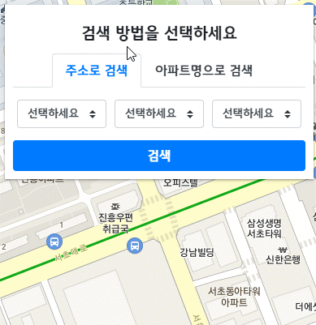  
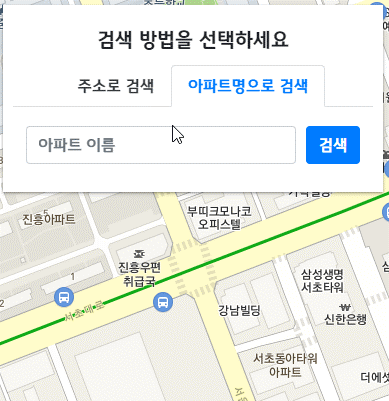  
아파트 명으로 검색 자동완성 기능
DB의 아파트리스트를 vue store에 저장 후 검색 시 정규식 필터링을 통해 검색어와 일치하는 결과 리스트 출력

### 아파트정보 – 드래그 이벤트
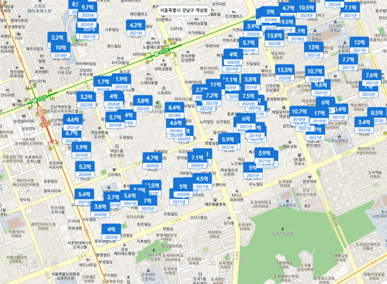  
상단 중심 좌표의 주소 표시
드래그 이후 호출된 api의 중심좌표값이 변경되면 watch로 확인 후 해당위치에 해당하는 매물 검색

### 아파트정보 – 상세 화면
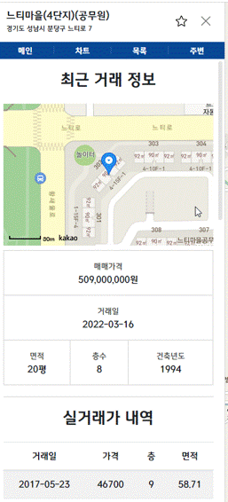  
아파트 클릭시 store의 house 값을 변경 시킨 후 aptCode 받아와 비동기로 정보 출력  
각각의 컴포넌트에서 최근 거래정보, 실거래가 내역, 연도병 평균거래가, 주변정보 추출  
우측 상단 별표 누를 시 로그인한 회원이면 관심목록에 추가, 아니면 안내문구 후 로그인으로 이동  
년도별 평균 거래가 vue-chart.js 활용  
아파트 연도별 거래가격 데이터를 리스트에 담은 후 x축, y축 값 저장 배열에 할당 후 출력  
주변정보 카카오 API  

### 부동산뉴스
  
네이버 뉴스 검색 API 활용  
부동산 뉴스 메뉴 클릭 시 검색어를 파라미터로 비동기 요청하여 서버의 controller에서 Api 클래스 실행한 결과 json 형식으로 리턴  

### 관심목록
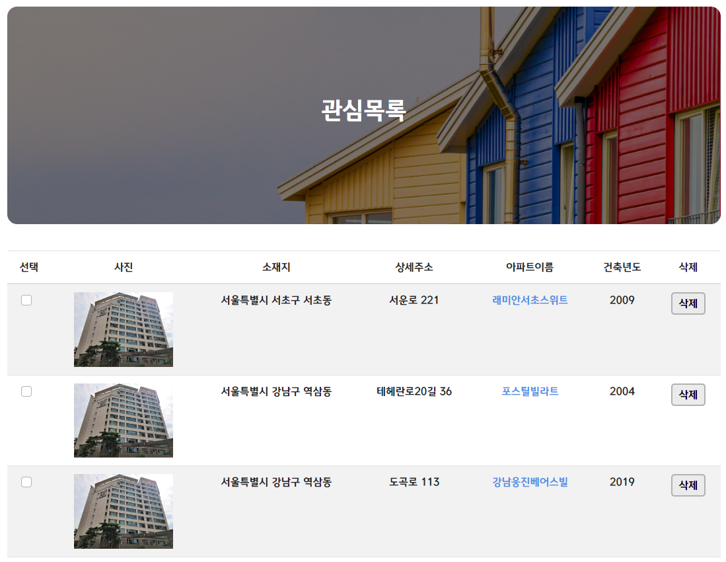  
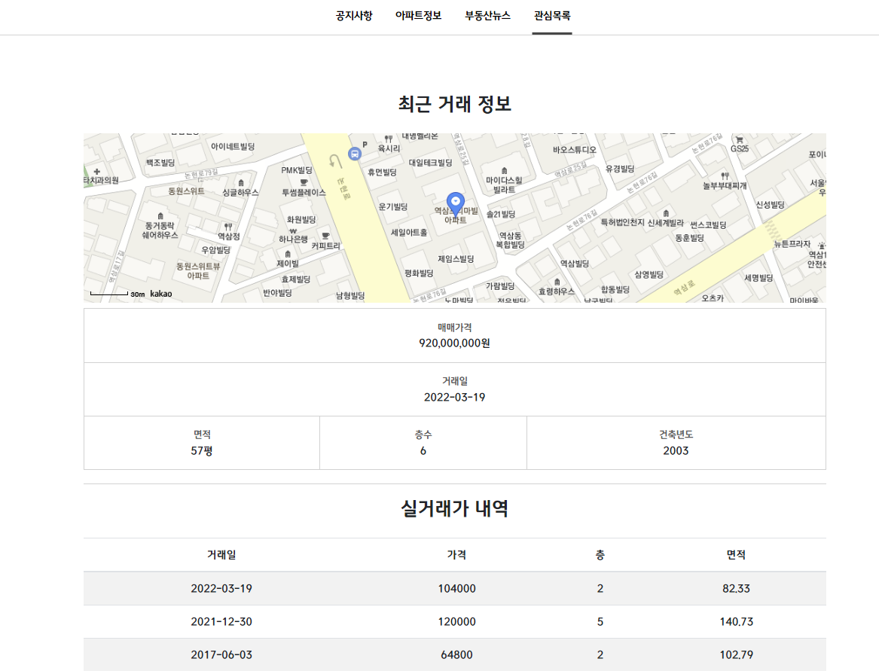  
로그인한 id 정보를 통해 관심목록 DB에서 등록된 관심목록 리스트 가져와 출력 삭제 후 리스트 초기화 위해 삭제 성공 시 리스트 재호출  
아파트 매물정보 검색 시 확인한 정보를 관심목록만 누르면 확인 가능하도록 함  

## 영상링크
https://youtu.be/adK3kC8Lb14

